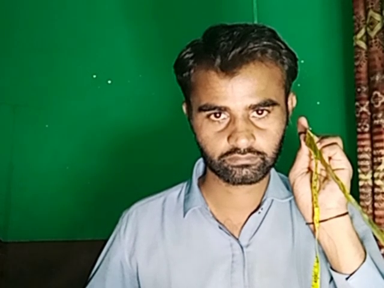

#  Face Detection and Distance Estimation using Single Camera 
> This is our **Third Project** of the course which is used to measure the distance from face to camera using normal webcam.

### TODO List
- [x] Capture The Reference image [ **Already completed the step** ]
- [x] Measure the Face width [ **Already completed the step** ]
- [ ] Detect the Face 
- [ ] Estimate the Distance 

## The Reference Image 
___
👉Here you can see that I am **measuring the distance from camera** to object using **measuring Tap** 👈
 
___
