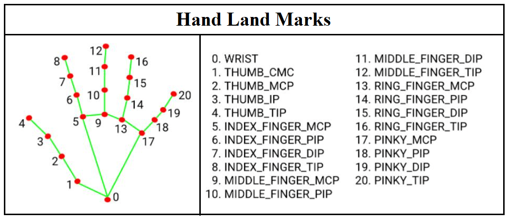

# Hand🖐️ Landmarks Detection 
Here we are going to detect the hands landmarks, after that we will create multiple projects using those Landmarks.

## TODO 
- [ ] Hand🖐️ Landmarks Detection Tutorial 
- [ ] Hand:raised_hand_with_fingers_splayed: AR (text) Project 
- [ ] Finger🤞 Contact Detection Project 
- [ ] Hand ✋ Sign Recognition Project (👍, 👌 🤙) 
- [ ] Picture :framed_picture: Viewer Controller with Hand:raised_hand_with_fingers_splayed:(Optional, Do It yourself or comment)
- [ ] Hand ✋ Landmark-Driven Robotics🤖(Optional, Do it yourself or comment)

## 21 Hand🖐️ Landmarks
 

---

I case you have any question, or you need help in project, please free to  DM me on Instagram.   <a href="https://www.instagram.com/aiphile17">
    